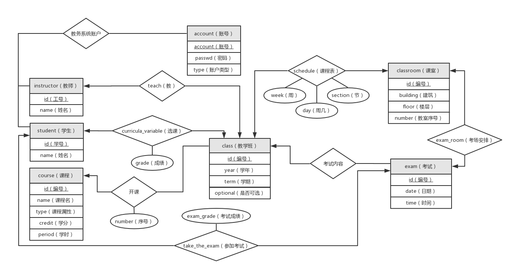

# 数据库模式设计文档

**E-R图**



**SQL**

```sql
CREATE TABLE account (
  account VARCHAR(32) PRIMARY KEY NOT NULL,  # 账号
  passwd VARCHAR(32) NOT NULL,               # 密码
  type VARCHAR(16) NOT NULL                  # 账户类型
);


CREATE TABLE student (
  id VARCHAR(11) PRIMARY KEY NOT NULL,  # 学号
  name VARCHAR(32) NOT NULL             # 姓名
  year INT NOT NULL                     # 入学年份
);

CREATE TABLE instructor (
  id VARCHAR(16) PRIMARY KEY NOT NULL,  # 编号
  name VARCHAR(32) NOT NULL             # 姓名
);

CREATE TABLE SUPERIOR(
   id VARCHAR(16) PRIMARY KEY NOT NULL,  # 编号
  name VARCHAR(32) NOT NULL
 );

CREATE TABLE ADMIN (
  id VARCHAR(16) PRIMARY KEY NOT NULL,  # 编号
  name VARCHAR(32) NOT NULL             # 姓名
);

CREATE TABLE course (
  id VARCHAR(16) PRIMARY KEY NOT NULL,  # 课程编号
  name VARCHAR(64) NOT NULL,            # 课程名
  type VARCHAR(16) NOT NULL,            # 课程属性
  credit NUMERIC(3, 1) NOT NULL,        # 学分
  period NUMERIC(5, 1) NOT NULL         # 学时
);

CREATE TABLE classroom (
  id VARCHAR(16) PRIMARY KEY NOT NULL,  # 课室编号
  building VARCHAR(32) NOT NULL,        # 建筑名
  floor INT NOT NULL,                   # 楼层
  number INT NOT NULL                   # 序号
);


CREATE TABLE class (
  id VARCHAR(32) PRIMARY KEY NOT NULL,  # 教学班编号
  year INT NOT NULL,                    # 开课学年
  term INT NOT NULL,                    # 开课学期
  course_id VARCHAR(16) NOT NULL,       # 所开课程
  number INT NOT NULL,                  # 序号
  optional BOOL，                       # 是否可以选课
  FOREIGN KEY (course_id) REFERENCES course(id)
);

CREATE TABLE exam (
  id VARCHAR(16) PRIMARY KEY NOT NULL,  # 考试编号
  class_id VARCHAR(32) NOT NULL,        # 课程id
  date DATE NOT NULL,                   # 日期 格式为年/月/日
  time TIME NOT NULL,                   # 时间 格式为小时:分钟， 按24小时制
  FOREIGN KEY (class_id) REFERENCES class(id)
);


CREATE TABLE curricula_variable (
  student_id VARCHAR(11) NOT NULL, # 学生学号
  class_id VARCHAR(32) NOT NULL,   # 教学班id
  grade NUMERIC(3, 1) NOT NULL,    # 课程成绩
  PRIMARY KEY (student_id, class_id),
  FOREIGN KEY (student_id) REFERENCES student(id),
  FOREIGN KEY (class_id) REFERENCES class(id)
);

CREATE TABLE teach (
  instructor_id VARCHAR(16) NOT NULL,  # 教师编号
  class_id VARCHAR(32) NOT NULL,
  PRIMARY KEY (instructor_id, class_id),
  FOREIGN KEY (instructor_id) REFERENCES instructor(id),
  FOREIGN KEY (class_id) REFERENCES class(id)
);

CREATE TABLE schedule (
  class_id VARCHAR(32) NOT NULL,
  classroom_id VARCHAR(16) NOT NULL,  # 课室id
  week INT NOT NULL,                  # 周
  day INT NOT NULL,                   # 天
  section INT NOT NULL,               # 节
  PRIMARY KEY (class_id, classroom_id),
  FOREIGN KEY (class_id) REFERENCES class(id),
  FOREIGN KEY (classroom_id) REFERENCES classroom(id)
);

CREATE TABLE exam_room (
  exam_id VARCHAR(16) NOT NULL,
  classroom_id VARCHAR(16) NOT NULL,
  PRIMARY KEY (exam_id, classroom_id),
  FOREIGN KEY (exam_id) REFERENCES exam(id),
  FOREIGN KEY (classroom_id) REFERENCES classroom(id)
);

CREATE TABLE take_the_exam (
  student_id VARCHAR(11) NOT NULL,    # 学生学号
  exam_id VARCHAR(16) NOT NULL,       # 考试id
  exam_grade NUMERIC(3, 1) NOT NULL,  # 考试成绩
  PRIMARY KEY (student_id, exam_id),
  FOREIGN KEY (student_id) REFERENCES student(id),
  FOREIGN KEY (exam_id) REFERENCES exam(id),
);

```


## 简要说明

```sql
CREATE TABLE account (
  account VARCHAR(32) PRIMARY KEY NOT NULL,  # 账号
  passwd VARCHAR(32) NOT NULL,               # 密码
  type VARCHAR(16) NOT NULL                  # 账户类型
);
```

- `account` 如果是学生、教师账户则为其id，如果是领导、管理员则随意定（以u开头，后面随意定（‘u’保证不会和学生、教师重复））
- `passwd` 密码的32位MD5摘要
- `type` 学生为‘student’，教师为‘instructor’，领导为‘superior’，普通管理员为‘admin’，系统管理员为‘root’


```sql
CREATE TABLE student (
  id VARCHAR(11) PRIMARY KEY NOT NULL,  # 学号
  name VARCHAR(32) NOT NULL             # 姓名
);
```

- `id` 同西电学号格式，11位
- `name` 学生姓名


```sql
CREATE TABLE instructor (
  id VARCHAR(16) PRIMARY KEY NOT NULL,  # 编号
  name VARCHAR(32) NOT NULL             # 姓名
);
```

- `id` 格式为名缩写加姓拼音缀数字，如‘yhluo’（罗阳豪），如有重复则后缀数字“yhluo_1”，
- `name` 教师名字


```sql
CREATE TABLE course (
  id VARCHAR(16) PRIMARY KEY NOT NULL,  # 课程编号
  name VARCHAR(64) NOT NULL,            # 课程名
  type VARCHAR(16) NOT NULL,            # 课程属性
  credit NUMERIC(3, 1) NOT NULL,        # 学分
  period NUMERIC(5, 1) NOT NULL         # 学时
);
```

- `id` 参考西电课程号
- `name` 课程名
- `type` 必修为1，校任选为2，人文类选修为3，学院选修为4
- `credit` 、 `period` 学分、学时，保留小数点后一位


```sql
CREATE TABLE classroom (
  id VARCHAR(16) PRIMARY KEY NOT NULL,  # 课室编号
  building VARCHAR(32) NOT NULL,        # 建筑名
  floor INT NOT NULL,                   # 楼层
  number INT NOT NULL                   # 序号
);
```

- `id` 通过 `building` 、 `floor` 、 `number` 生成，如 (“B-206”, “B”, 2, 6), ("EI-208", "EI", 2, 8)


```sql
CREATE TABLE class (
  id VARCHAR(32) PRIMARY KEY NOT NULL,  # 教学班编号
  year INT NOT NULL,                    # 开课学年
  term INT NOT NULL,                    # 开课学期
  course_id VARCHAR(16) NOT NULL,       # 所开课程
  number INT NOT NULL,                  # 序号
  optional BOOL，                       # 是否可以选课
  FOREIGN KEY (course_id) REFERENCES course(id)
);
```

“教学班”并不是一般所说的班级，是指一个学期、一门课的一个班，比如2018年上半年高数II的某个班

- `id` 格式“课程编号+_序号”（如，"AM1001L_1"）
- `term` 上半年为2，下半年为1（或者理解为第一学期为1，第二学期为2）
- `number` 该学期该门课开了多个班的，序号由1开始递增


```sql
CREATE TABLE exam (
  id VARCHAR(16) PRIMARY KEY NOT NULL,  # 考试编号
  class_id VARCHAR(32) NOT NULL,        # 课程id
  date DATE NOT NULL,                   # 日期
  time TIME NOT NULL,                   # 时间
  FOREIGN KEY (class_id) REFERENCES class(id)
);
```

- `id` 格式“考试的教学班id+_表示考试性质的字符串（比如期中考’m‘，期末考‘f’）”
- `date` ，日期格式“YYYY-MM-DD”
- `time`， 时间格式“hh:mm:ss”


```sql
CREATE TABLE curricula_variable (
  student_id VARCHAR(11) NOT NULL, # 学生学号
  class_id VARCHAR(32) NOT NULL,   # 教学班id
  grade NUMERIC(3, 1) NOT NULL,    # 课程成绩
  PRIMARY KEY (student_id, class_id),
  FOREIGN KEY (student_id) REFERENCES student(id),
  FOREIGN KEY (class_id) REFERENCES class(id)
);
```

表示学生应上的课

- 课程成绩如果还没录入则为-1


```sql
CREATE TABLE teach (
  instructor_id VARCHAR(16) NOT NULL,  # 教师编号
  class_id VARCHAR(32) NOT NULL,
  PRIMARY KEY (instructor_id, class_id),
  FOREIGN KEY (instructor_id) REFERENCES instructor(id),
  FOREIGN KEY (class_id) REFERENCES class(id)
);
```

表示某课的任课老师，一节课有多位老师可列多条


```sql
CREATE TABLE schedule (
  class_id VARCHAR(32) NOT NULL,
  classroom_id VARCHAR(16) NOT NULL,  # 课室id
  week INT NOT NULL,                  # 周
  day INT NOT NULL,                   # 天
  section INT NOT NULL,               # 节
  PRIMARY KEY (class_id, classroom_id),
  FOREIGN KEY (class_id) REFERENCES class(id),
  FOREIGN KEY (classroom_id) REFERENCES classroom(id)
);
```

- `week` ，第几周，从1开始递增
- `day` ，周一到周六是1到6，周日是0
- `section` ，一天5节，上午两节，下午两节，晚上一节，分别是1到5


```sql
CREATE TABLE exam_room (
  exam_id VARCHAR(16) NOT NULL,
  classroom_id VARCHAR(16) NOT NULL,
  PRIMARY KEY (exam_id, classroom_id),
  FOREIGN KEY (exam_id) REFERENCES exam(id),
  FOREIGN KEY (classroom_id) REFERENCES classroom(id)
);
```
表示考场安排


```sql
CREATE TABLE take_the_exam (
  student_id VARCHAR(11) NOT NULL,    # 学生学号
  exam_id VARCHAR(16) NOT NULL,       # 考试id
  exam_grade NUMERIC(3, 1) NOT NULL,  # 考试成绩
  PRIMARY KEY (student_id, exam_id),
  FOREIGN KEY (student_id) REFERENCES student(id),
  FOREIGN KEY (exam_id) REFERENCES exam(id),
);
```

往exam插入一条记录同时根据class_id查找应该参加该考试的学生，并将相应结果插入该表

- `exam_grade` 考试成绩，不同于上述的课程成绩，成绩未录入时为-1


---

> 罗阳豪，2018.05.07 21:40

